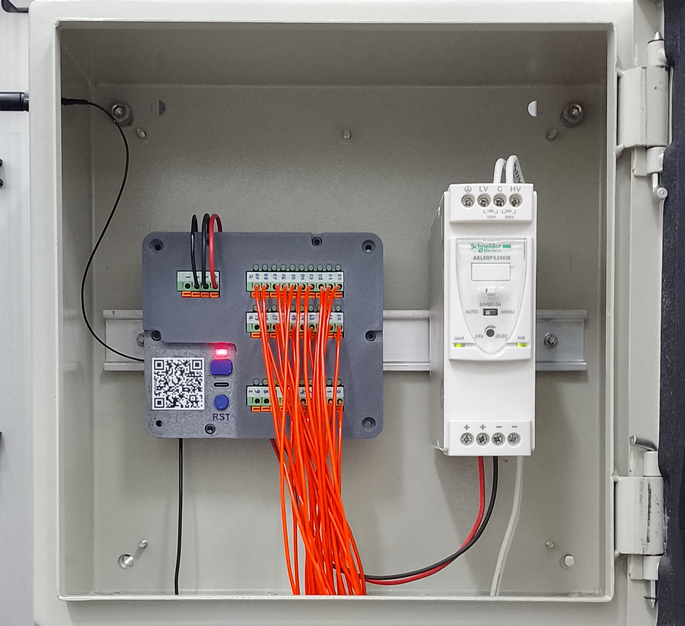

# ESP32 Remote I/O

A low-cost industrial remote input/output device based on the ESP32-S3 SoC from Espressif.

## Features

* **WiFi Connectivity:** Connects to an existing WiFi network using configuration read from non-volatile storage. External antenna.
* **Digital Inputs (DI):** Ten 24 V digital, sink type, inputs.
* **Digital Outputs (DQ):** Twenty 24 V digital, sink type, outputs.
* **Output Enable (OE) Button:** A push button to globally enable/disable digital outputs.
* **Status LED:** Steady on when digital outputs are enabled. Blinks Morse code for the letter W when disconnected from WiFi network.
* **USB Console:** A command-line interface over USB Serial/JTAG for runtime configuration (e.g., WiFi setup) and debugging.
* **Reset Button:** For manually restarting the board.
* **Power Input:** 24 V, 267 mA (max.).

---
*For any issues or contributions, please refer to the project's [GitHub repository](https://github.com/dougsthenri/esp32_rio.git).*
