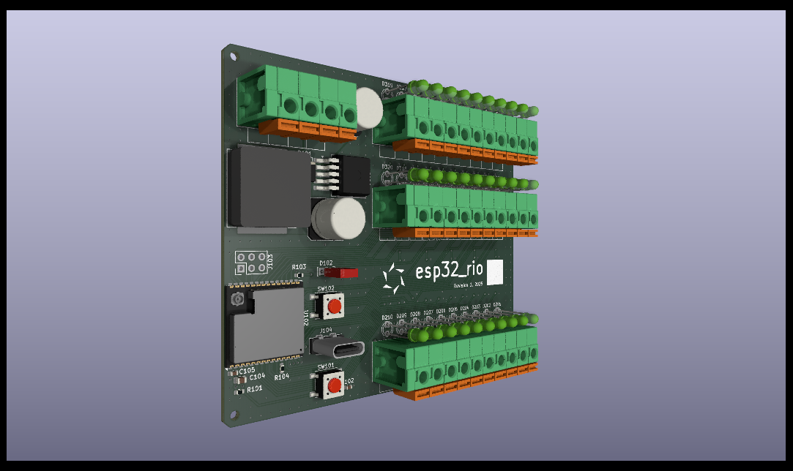

# esp32_rio
PCB project for a low-cost industrial remote I/O device based on the ESP32-S3 SoC from Espressif.
Proudly made using KiCad 9.0.

---
*For any issues or contributions, please refer to the project's [GitHub repository](https://github.com/dougsthenri/esp32_rio.git).*
