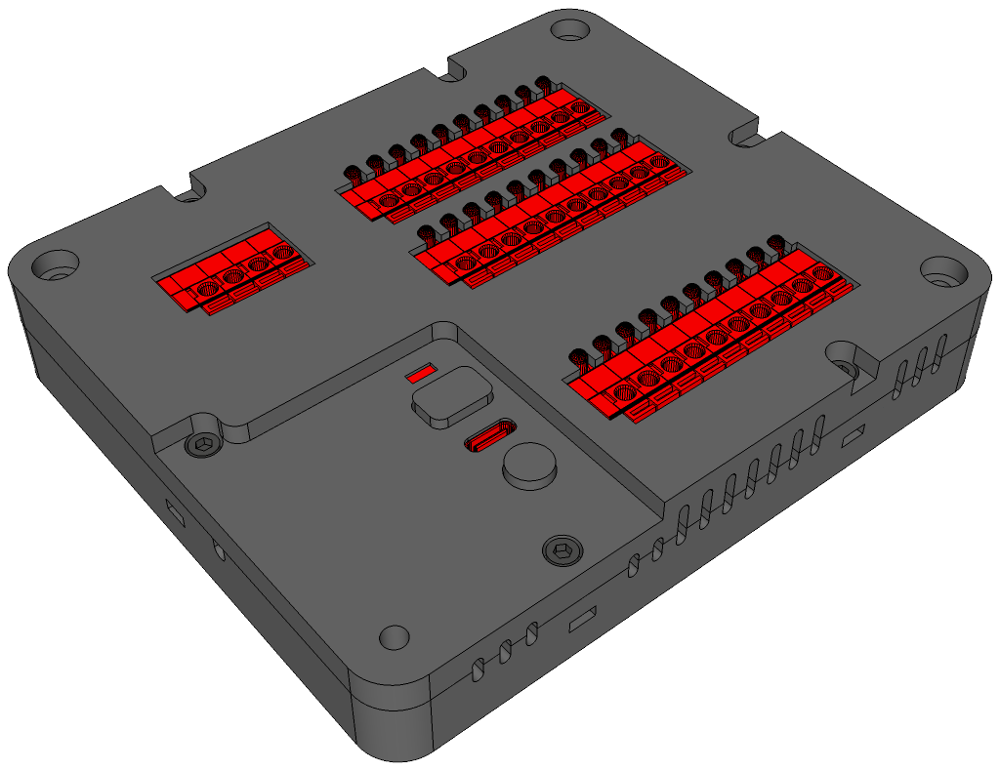
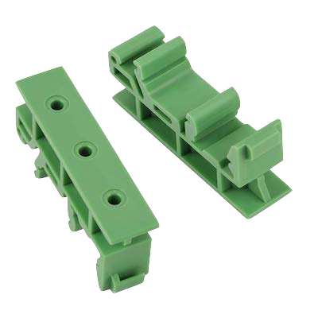

# ESP32 Remote I/O Case
A 3D-printable plastic case for the ESP32 RIO board.

The encased board can be mounted on a 35 mm DIN rail by attaching two 43 mm mounting brackets on its back. Alternatively it can be directly mounted to a wall by using four 4x25 mm screws.
Refer to the `esp32_rio-case.skp` file for the complete case assembly.

---
*For any issues or contributions, please refer to the project's [GitHub repository](https://github.com/dougsthenri/esp32_rio.git).*
